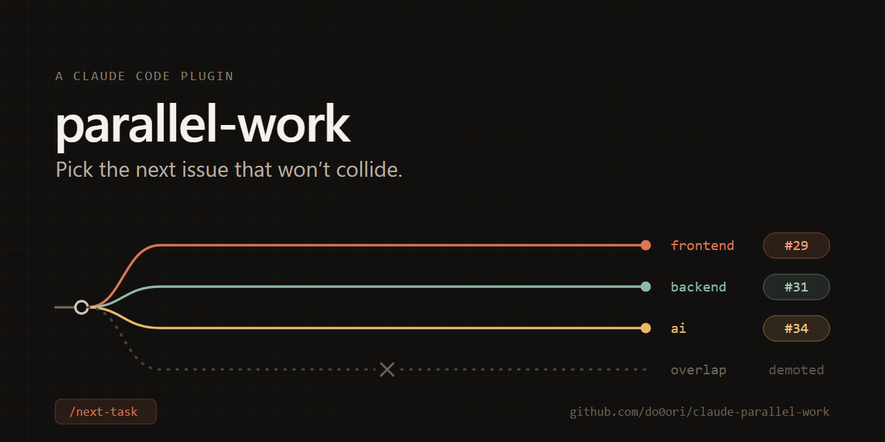

# parallel-work

[English](README.md)

겹치지 않는 다음 GitHub 이슈를 골라 병렬 Claude Code 세션을 시작하는 플러그인.

Claude Code 는 이미 `claude --worktree <이름>` 으로 워크트리를 만들고 그 안에서
세션을 띄운다. 파일 격리는 그것으로 끝난다. 남는 문제는 그 위에 있다 —
**무엇을 가져갈 것인가.** 세션을 서너 개 굴리다 보면 "지금 뭐가 돌고 있더라"를
사람이 기억해야 하고, 결국 두 세션이 같은 파일을 만지거나 이미 하고 있는 일을
또 집는다.

이 플러그인은 그 판단을 담당한다. 워크트리는 직접 만들지 않는다 —
`claude --worktree` 가 이미 한다.

## 설치

```bash
claude plugin marketplace add do0ori/claude-parallel-work
claude plugin install parallel-work@do0ori
```

## 쓰는 법

주 체크아웃에서:

```
/parallel-work:next-task
```

플러그인 커맨드는 플러그인 이름으로 네임스페이스된다. 짧은 `/next-task` 는 존재하지
않는 이름이다. 물론 **어느 쪽도 외울 필요는 없다.** 그냥 말해도 된다 — "다음 뭐 할까", "겹치지 않는
작업 하나 가져와", "새 세션 띄워서 하나 더 시작하자" 같은 말에 알아서 걸린다.
`/parallel-work:next-task` 와 `/parallel-work:work-issue` 는 같은 스킬로 들어가는
지름길일 뿐이다.

진행 중인 워크트리를 조사해 겹치지 않는 이슈를 고르고, 담당자로 자신을 걸고,
새 세션을 연다.

```
선택: #29 SplashScreen 이 SafeAreaProvider 바깥에서 렌더된다
  근거: P1 · bug · frontend
  겹침: 없음
  선점: assignee=do0ori ✓

새 터미널에 붙여넣으세요:
  claude --worktree frontend/splash-safe-area "/parallel-work:work-issue 29"
```

새 터미널에서 그 명령을 실행하면 워크트리가 생기고, 그 세션이 `/parallel-work:work-issue 29`
로 브랜치 이름을 정돈하고 환경을 갖춘 뒤 이슈를 읽고 착수한다.

`/parallel-work:next-task --dry-run` 은 순위와 근거만 보여주고 선점하지 않는다.

## 어떻게 겹침을 판단하나

**영역**(area)이라는 하나의 개념으로 판단한다. 영역은 저장소를 나누는 큰
덩어리다 — `frontend`, `backend`, `ai` 같은 것.

- **이슈의 영역**은 그 이슈에 붙은 라벨에서 온다.
- **워크트리의 영역**은 그 워크트리가 실제로 건드린 파일에서 온다. 아직
  아무것도 안 바꿨으면 브랜치 이름으로 추정한다.
- 후보 이슈의 영역이 진행 중인 워크트리의 영역과 겹치면 순위를 내린다.

경로 → 영역 매핑은 저장소의 [`actions/labeler`](https://github.com/actions/labeler)
설정(`.github/labeler.yaml`)이 있으면 그대로 읽는다. PR 라벨과 같은 규칙을 써야
"라벨이 말하는 영역"과 "겹침 판정이 말하는 영역"이 갈라지지 않는다.

### actions/labeler 를 쓰지 않는 저장소

**필수가 아니다.** `.github/labeler.yaml` 이 없으면 최상위 디렉터리를 영역으로
삼는다 — `frontend/`, `backend/` 가 있으면 그게 영역이 된다. 그 사실은 경고로
알린다.

이슈 쪽은 라벨 이름으로 맞춘다. 이때 **글자와 숫자만 남기고 소문자로 만들어**
비교하므로, 라벨이 `🖥️frontend` 든 `Front-End` 든 디렉터리 `frontend` 와 이어진다.
그래서 라벨 이름을 디렉터리 이름에 맞춰 붙이기만 하면 labeler 없이도 겹침 판정이
그대로 돈다.

이슈에 영역과 이어지는 라벨이 하나도 없으면 그 이슈는 `영역 라벨 없음 — 겹침
판정 불가` 로 표시된다. 순위에서 빠지지는 않지만, 겹치는지 아닌지는 사람이
판단해야 한다.

**겹침은 제외가 아니라 감점이다.** 겹치는 후보밖에 없으면 임의로 고르지 않고
사람에게 묻는다.

하드 제외는 따로 있다.

- **다른 사람이** 담당이다 (내가 담당인 것은 빼지 않고 1 순위로 올린다)
- Project Status 가 제외 목록에 있다
- 진행 중인 워크트리·PR 이 그 이슈를 참조한다
- 아직 열려 있는 이슈에 막혀 있다 (`blockedBy`)
- 하위 이슈로 쪼개져 있고 그중 열린 것이 남아 있다 (`subIssues`)

뒤의 둘은 GitHub 의 이슈 관계를 그대로 읽는다. 이슈를 쪼개 작업하느라 닫지 않는
PR 도 참조로 친다 — `refactor: 토큰 도입 (#18 ①)` 같은 제목이면 #18 과 이어진
것으로 본다. 제목은 사람이 다듬는 자리라 이슈 번호가 우연히 들어가지 않는다.
본문에 지나가듯 적힌 `#N` 은 세지 않는다.

## 순위

| 순위 | 기준 |
| --- | --- |
| 1 | 이미 내가 선점한 것 — 걸어둔 것부터 끝낸다 |
| 2 | Priority — 설정한 순서대로, 미설정은 맨 뒤 |
| 3 | 겹침 — 겹치면 뒤로 |
| 4 | Status — 설정한 순서대로 |
| 5 | 라벨 — `bug` > `enhancement` > 그 외 |
| 6 | 이슈 번호 — 오래된 것 먼저 |

### 보드 없이 Priority·Status 쓰기

2·4 번 기준은 Project 의 필드를 읽으므로 보드가 없으면 함께 죽고,
`excludeStatuses` 도 그때 같이 걸리지 않는다. 그런데 보드를 아예 못 쓰는
저장소가 있다 — 저장소와 보드의 소유자가 달라 연결되지 않거나, 외부 협업자가
섞여 보드 권한을 나눌 수 없거나(조직 기본 권한은 멤버에게만 적용된다).

그래서 두 값을 **이슈에** 둘 수 있다. `priorityOrder`·`statusOrder`·
`excludeStatuses` 에 적힌 값과 이름이 같은 라벨을 그 값으로 읽는다 — `P0` 라벨은
Priority `P0` 처럼 순위에 들고, `in-progress` 라벨은 Status `In Progress` 처럼
후보에서 빠진다. 대소문자·기호 차이는 영역 라벨과 같은 규칙으로 무시한다.

**보드에 값이 있으면 보드가 이긴다.** 라벨은 폴백이라, 두 곳에 값이 있어도
순위가 말없이 달라지지 않는다.

## 새 세션을 여는 방식

`launch` 가 고른다.

| | 하는 일 |
| --- | --- |
| `print` (기본) | 붙여넣을 명령 한 줄을 출력한다 |
| `session` | 새 창을 열어 그 안에서 세션을 바로 시작한다 |

`print` 가 기본인 이유는 어느 터미널·어느 OS 에서든 확실히 동작하고, 띄우기 전에
선택을 한 번 볼 수 있어서다.

`session` 은 중간에 셸 스크립트를 하나 만들고 터미널에게 그것을 실행시킨다.
명령을 터미널 인자로 직접 넘기면 OS 마다 다른 따옴표 규칙에 걸려 조용히 깨진다.

| OS | 여는 방법 |
| --- | --- |
| Windows | Windows Terminal(`wt`) 이 있으면 새 탭, 없으면 새 `cmd` 창 |
| macOS | `open -a Terminal` |
| Linux | `x-terminal-emulator` / `gnome-terminal` / `konsole` / `xterm` 중 있는 것 |

맞는 게 없으면 `terminalCommand` 로 직접 지정한다. `{script}` 가 실행할 파일로,
`{dir}` 가 저장소 루트로 바뀐다.

```json
"terminalCommand": ["wezterm", "start", "--cwd", "{dir}", "--", "{script}"]
```

열리는 창은 **별도의 창**이다. 명령을 실행한 터미널의 새 탭이 아니므로, 못 찾겠으면
작업표시줄을 보라.

새 세션은 부모 세션의 Claude 환경변수를 지운 상태로 뜬다. 그러지 않으면
`CLAUDE_CODE_CHILD_SESSION` 같은 표식을 물려받아 자기를 남의 자식 세션으로 여기고
플러그인을 하나도 로드하지 않는다. 그러면 `/work-issue` 가 `Unknown command` 로
끝나고 세션은 아무것도 하지 않은 채 앉아 있는다.

창을 여는 데 실패하면 붙여넣을 명령을 대신 내놓는다. 막다른 길이 되지는 않는다.

## ready 를 부르기 전에 리베이스한다

마무리는 기본 브랜치를 따라잡는 것에서 시작한다.

```bash
git pull --rebase origin <기본 브랜치>
```

병렬 작업에서 이건 선택이 아니다. 작업하는 동안 다른 세션들이 머지하면서 기본
브랜치가 계속 움직인다. 건너뛰면 **CI 가 낡은 기반에서 통과한 결과로 머지된다** —
각자 초록인데 합치면 깨지는 브랜치가 정확히 이렇게 만들어진다. 리베이스 후에는
`git push --force-with-lease` 가 필요하고, 두 번째 초록까지 확인해야 머지 준비가
끝난다.

충돌이 나면 **혼자 풀지 말고 멈춰서 알린다.** 다른 세션이 같은 자리를 이미
바꿨다는 뜻이고, 어느 쪽이 맞는지는 사람의 판단이다.

머지 자체도 사람이 결정한다 — 초록은 머지 신호가 아니다. 리뷰가 남아 있을 수
있고, 브랜치를 여럿 굴리는 중이면 머지 **순서**가 판단 대상이다.

## 머지되면 고리를 닫는다

선점하면 Status 가 `In Progress` 로 올라가지만, 되돌리는 것은 아무도 하지 않는다.
작업을 끝낸 세션이 직접 내려야 한다.

```bash
node <플러그인>/skills/picking-parallel-work/scripts/set-status.mjs <이슈번호> Done
```

단순히 지저분해지는 문제가 아니다. `In Progress` 는 하드 제외 대상이라, 머지가
끝났는데 그대로 남은 이슈는 후보로 영영 돌아오지 않는다. 일부만 끝낸 이슈라면
그 뒷부분을 아무도 집지 못한다.

## 만든 것을 치운다

작업이 끝난 워크트리는 지저분한 정도로 끝나지 않는다. 조사할 때
`git worktree list` 를 "진행 중인 작업" 으로 읽으므로, 끝난 워크트리가 그 영역을
영원히 점유한다. 남겨둔 `frontend` 워크트리 하나 때문에 이후 모든 frontend 이슈가
조용히 감점된다. 커밋이 이미 기본 브랜치에 있으니 변경 파일도 안 나와서 브랜치
이름 추정으로 넘어가고, 그래서 틀린 줄도 모른다.

`/parallel-work:next-task` 가 고르기 전에 알아서 하고 무엇을 지웠는지 보고한다.
직접 돌릴 수도 있다.

```bash
node <플러그인>/skills/picking-parallel-work/scripts/cleanup.mjs          # 무엇을 지울지
node <플러그인>/skills/picking-parallel-work/scripts/cleanup.mjs --apply  # 지운다
```

**이 플러그인이 만든 워크트리와 그 브랜치만** 지운다 — 워크트리, 로컬 브랜치,
그리고 아직 남아 있으면 원격 브랜치까지. 저장소의 다른 머지된 브랜치는 이 도구의
일이 아니다.

locked 워크트리(세션이 아직 돌 수 있다), 커밋이 기본 브랜치에 다 안 들어간
워크트리, 변경사항이 남은 워크트리는 건너뛴다. 무엇을 왜 남겼는지 출력에 적는다.

**워크트리는 그 작업을 한 세션이 직접 치운다.** 마무리 마지막 단계에서
`ExitWorktree` 도구로 없앤다. 여기의 정리는 그게 안 됐을 때를 위한 안전망이다 —
세션이 죽었거나, 종료할 때 keep 을 골랐거나.

주 체크아웃에서 실행해야 한다. 세션은 자기가 서 있는 워크트리를 지울 수 없다.

## 설정

**설정 없이 그냥 써도 된다.** `.claude/parallel-work.json` 은 선택이다. Project 가
하나뿐이면 알아서 찾고, 영역은 `.github/labeler.yaml` 이나 최상위 디렉터리에서
읽고, 나머지는 기본값으로 돈다. 값을 못 정한 자리는 조용히 넘어가지 않고 경고로
알린다.

필요해지는 시점도 정해져 있다.

| 증상 | 채울 것 |
| --- | --- |
| "Project 가 N 개라 정하지 못했다" 경고 | `projectNumber` |
| "그 소유자 밑에 Project 가 없다" 경고인데 보드는 있다 | `projectOwner` |
| Priority·Status 값 이름이 다른 저장소 | `priorityField` / `statusField` / `priorityOrder` / `statusOrder` |
| 새 워크트리에서 빌드가 설치물 없이 실패 | `setup` |
| 새 세션을 창까지 열어 시작하고 싶다 | `launch` |

**직접 쓸 필요도 없다.** "병렬 작업 설정해줘" 라고 하면 저장소를 읽어 값을
제안한다 — Project 목록과 필드 이름은 `gh` 로 확인하고, 영역별 준비 명령은
`package.json`·`requirements.txt` 가 어디 있는지 보고 채운다.

파일을 두면 아래 키를 덮어쓸 수 있다.

```json
{
    "projectNumber": 1,
    "projectOwner": "my-org",
    "priorityField": "Priority",
    "priorityOrder": ["P0", "P1", "P2"],
    "statusField": "Status",
    "statusOrder": ["Todo", "", "Backlog"],
    "excludeStatuses": ["In Progress", "Done"],
    "labelOrder": ["bug", "enhancement"],
    "areaSource": ".github/labeler.yaml",
    "claimStatus": "In Progress",
    "launch": "print",
    "setup": {
        "frontend": "npm install --prefix frontend",
        "ai": "pip install -r ai/requirements.txt"
    }
}
```

| 키 | 뜻 |
| --- | --- |
| `projectNumber` | GitHub Project 번호. 생략하면 소유자의 Project 가 정확히 하나일 때만 자동으로 찾는다 |
| `projectOwner` | Project 를 찾을 소유자. 기본은 저장소 소유자 — 보드가 다른 사용자·조직 밑에 있을 때 적는다 |
| `priorityField` / `statusField` | Project 의 필드 이름 |
| `priorityOrder` / `statusOrder` | 앞에 있을수록 먼저. `""` 는 값이 비어 있는 이슈 |
| `excludeStatuses` | 이 Status 인 이슈는 후보에서 제외 |
| `areaSource` | 경로 → 영역 매핑을 읽을 파일 |
| `claimStatus` | 선점할 때 옮길 Status. `null` 이면 옮기지 않는다 |
| `launch` | `"print"`(기본) 또는 `"session"`. 위 표를 보라 |
| `terminalCommand` | `session` 에서 창을 여는 명령을 직접 지정 |
| `setup` | 영역별 환경 준비 명령. `/parallel-work:work-issue` 가 **건드릴 영역의 것만** 실행한다 |

`statusOrder` 의 `""` 는 Project 에 올라 있지 않거나 Status 가 비어 있는 이슈를
뜻한다. 위 예시는 "Todo 가 먼저, 그다음 미분류, Backlog 는 맨 뒤"로 읽는다.

### 새 워크트리에 설정 파일 딸려 보내기

워크트리는 새 체크아웃이라 gitignore 된 `.env` 류가 없다. 저장소 루트에
`.worktreeinclude` 를 두면 Claude Code 가 워크트리를 만들 때 복사한다.

```
frontend/.env
proxy/.env
```

**직접 쓸 필요는 없다.** 새 세션을 열기 직전에, 목록에 없는 gitignore 된 `.env` 류를
찾아 채워 넣고 무엇을 더했는지 알린다.

```
Added to .worktreeinclude so the new worktree gets them: frontend/.env, proxy/.env
```

커밋되는 파일이라 말없이 고치지 않고 항상 보고한다.

## 요구사항

`git`, 인증된 `gh`, Node 18 이상. 조사 스크립트는 외부 패키지를 쓰지 않는다 —
`node_modules` 가 없는 새 워크트리에서도 돌아야 하기 때문이다.

Windows, macOS, Linux 에서 똑같이 동작한다. 절대 경로를 박아두지 않고, 창을 여는
방법은 OS 별로 갈라 처리한다.

GitHub Project 는 없어도 된다. 없으면 Priority·Status 없이 겹침·라벨·이슈 번호
로만 순위를 매기고, 그 사실을 경고로 알린다.

## draft PR 을 먼저 연다

이 도구가 지키는 하나의 규칙이다. 작업을 **시작하면서** PR 을 draft 로 열고,
본문에 `Closes #<번호>` 를 넣는다.

로컬 워크트리는 `git worktree list` 로만 보이고 그건 **내 머신만** 안다. 게다가
그 워크트리가 어느 이슈의 작업인지는 연결된 PR 이 있어야 안다. draft PR 하나가
그 둘을 동시에 메운다 — 남에게도 보이고, 나중에 세션을 하나 더 띄우는 나에게도
보인다. 다 만들고 나서 열면 그동안 누군가 같은 영역을 집는다.

혼자 쓸 때도 마찬가지다. PR 이 없으면 `이슈 불명` 으로 뜨고, 그 워크트리가 잡고
있는 이슈가 후보 목록에 그대로 남는다.

## 여러 명이 쓸 때

혼자 세션을 여럿 띄우든 팀으로 나눠 쓰든 똑같이 동작한다. 모드 같은 건 없다.

- **선점 경합.** GitHub 에는 이슈를 원자적으로 잠그는 수단이 없다. 같은 순간에
  둘이 집으면 둘 다 담당자로 올라간다. `claim.mjs` 는 담당자를 건 뒤 **되읽어**
  다른 사람이 함께 올라와 있는지 본다. 그렇다면 0 이 아닌 값으로 끝나고, 늦게
  온 쪽이 물러난다. 이 되읽기가 락을 대신한다.
- **내 담당과 남의 담당.** 남이 담당인 이슈는 후보에서 뺀다. 내가 담당인 이슈는
  빼지 않고 `이미 내가 선점함 — 이어받기` 로 표시해 **순위 맨 앞**에 올린다.
  지난번에 걸어두고 아직 시작하지 않은 것을 먼저 끝내라는 뜻이다.
- **남의 진행 중 작업.** 열린 PR 의 변경 파일에서 영역을 뽑아 점유에 반영한다.
  작성자와 draft 여부도 함께 보여준다.

### 하나 남는 한계

**남의 로컬 워크트리는 볼 수 없다.** 아직 PR 을 열지 않은 남의 작업은 이 도구에
보이지 않는다. 위의 draft PR 규칙이 이 구멍을 메우는 유일한 방법이고, 도구가
아니라 사람이 지켜야 한다.

## 라이선스

MIT
